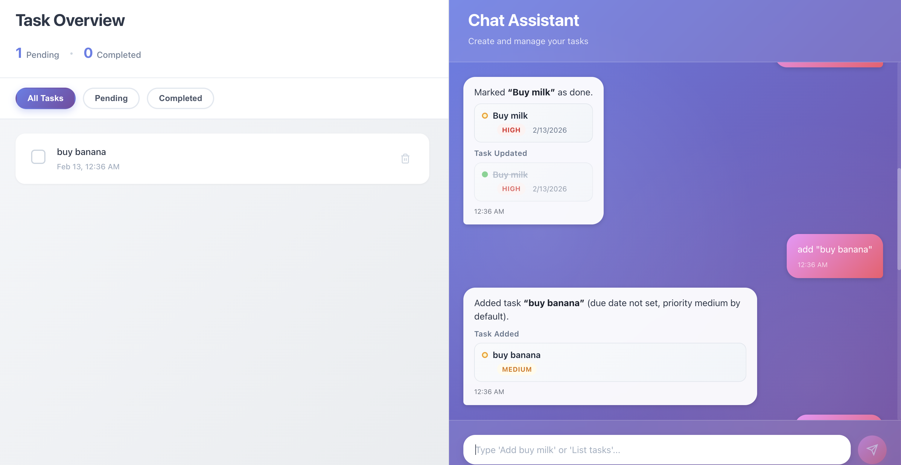

# AI-Driven Task Manager

A modern, full-stack task management application where **"Chat is the App"**. Built with [TanStack Start](https://tanstack.com/start), [Vercel AI SDK](https://sdk.vercel.ai/docs), and strict TypeScript patterns.

## Features

- **Natural Language Interaction**: Add, update, delete, and query tasks using conversational AI.
- **Split-Screen Interface**: Real-time synchronization between the Chat Assistant (right) and the Task List (left).
- **Task Visualization**: AI responses rendered as rich, interactive cards within the chat stream.
- **Smart Filtering**: Filter tasks by status (Pending/Completed) or ask the AI to show "overdue tasks".
- **Persistent Data**: Local file-based persistence (easily swappable for a real DB).

## Stack

- **Framework**: TanStack Start (React + Vite + Vinxi)
- **Language**: TypeScript
- **AI**: Vercel AI SDK + OpenAI
- **Styling**: CSS (Modular/Component-scoped)
- **Data**: JSON (Local filesystem)

## Architecture & Decisions

### 1. Framework: TanStack Start (Full Stack)
We chose **TanStack Start** (with Vite 7) to leverage Server Functions (RPC) and seamless client-server type safety.
- **Why?** It eliminates the need for a separate API layer for CRUD operations. Server functions like `getTasks` and `addTask` are called directly from the client or the Chat API, ensuring end-to-end type safety.

### 2. AI Integration: Vercel AI SDK
- **Streaming**: Uses `streamText` for real-time, token-by-token responses.
- **Tool Calling**: The LLM is equipped with strictly typed tools (`addTask`, `updateTask`, etc.) defined with Zod schemas.
- **Generative UI**: The chat interface doesn't just output text; it renders React components (`TaskCard`) based on the tool execution results.

### 3. Service Layer Pattern (SOLID)
We decoupled the business logic and data access from the UI and API routes.
- **`src/services/taskService.ts`**: Handles all data operations (Read/Write to JSON). This allows us to swap the JSON storage for PostgreSQL or Prisma in the future *without changing a single line of UI or API code*.

### 4. Schema-First Design (DRY)
- **`src/lib/schemas/`**: Shared Zod schemas define the shape of our data (`Task`, `ChatMessage`).
- **Single Source of Truth**: These schemas are used for:
  - Validating API inputs (Server).
  - Typing React props (Client).
  - Defining AI Tool parameters (LLM).

### 5. Component Decomposition
The UI is broken down into small, focused components:
- **`Chat/`**: `ChatPanel`, `MessageBubble`, `ChatInput`, `TaskCards`.
- **`Tasks/`**: `TaskList`, `TaskItem`, `TaskStats`, `TaskFilter`.
- **Custom Hooks**: `useAutoScroll` encapsulates DOM manipulation logic.


## Future Improvements

While the current implementation is robust, a production-ready version would include:

1.  **Database Migration**: Replace `taskService`'s JSON logic with a real database (PostgreSQL/SQLite) using Drizzle or Prisma.
2.  **Authentication**: Add user accounts so tasks aren't shared globally (e.g., Clerk or Auth.js).
3.  **Testing**:
    - **Unit Tests**: For `taskService` and Zod schemas.
    - **E2E Tests**: Playwright tests to automate the "Acceptance Tests" workflow.
4.  **Optimistic UI**: Implement optimistic updates in `TaskList` for instant feedback before server confirmation.

## Getting Started

1.  **Install Dependencies**:
    ```bash
    npm install
    ```

2.  **Environment Setup**:
    Create a `.env` file with your OpenAI key:
    ```env
    OPENAI_API_KEY=sk-your-key-here
    ```

3.  **Run Development Server**:
    ```bash
    npm run dev
    ```
    Open [http://localhost:3000](http://localhost:3000).

## Acceptance Tests

- **Add Task**: "Add task 'Buy milk' due tomorrow high priority"
- **List Tasks**: "List my tasks" (Shows cards)
- **Update Task**: "Mark 'Buy milk' done"
- **Delete Task**: "Delete 'Buy milk'"
- **Filter**: "Show overdue tasks"


## UI



